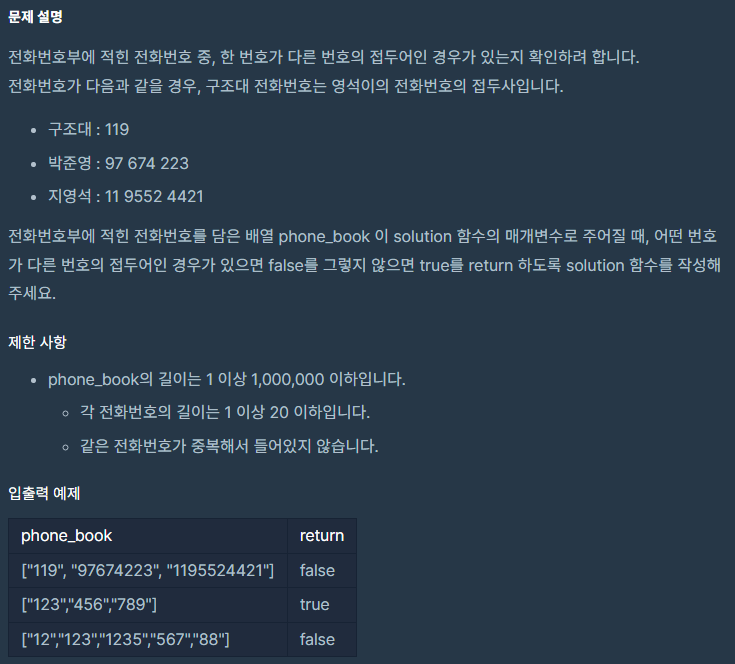
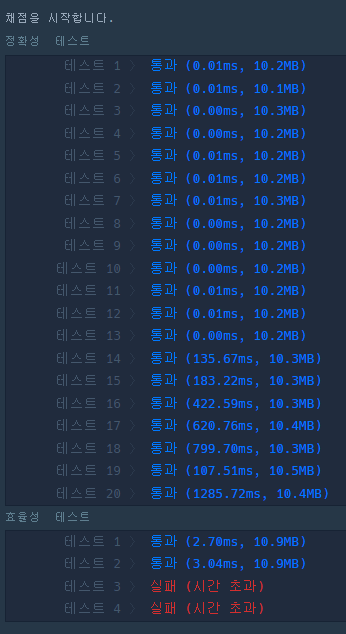

# 전화번호 목록

공부 시점: 2022/02/03
문제 푼 사람: 익명
사이트: programmers
진행 상황: 풀이 분석 중
카테고리: Hash

[문제 링크](https://programmers.co.kr/learn/courses/30/lessons/42577)

# ✏️문제 설명



`phone_book`의 요소 중 하나가 다른 요소에 완전히 포함되어 있는 경우엔 `False`를 출력하라는 문제.

# 📖문제 풀이

```python
def solution(phone_book):
    tmp = sorted(phone_book)
    
    for idx, x in enumerate(tmp):
        for idy, y in enumerate(tmp):
            if idx >= idy:
                continue
            if y.find(x) == 0:
                return False
    return True
```

> 우선 문제 풀이 시간을 줄이기 위해 `phone_book` 을 길이순으로 정렬하고 2 차원 표로 정리해 생각하기로 했다. x축과 y축 모두에 `phone_book` 을 넣고 x축의 번호가 y축의 번호에 포함되면 그 즉시 `False`를 출력하도록 만들었다. 그 결과 정확도 측면에서는 모두 합격을 하였으나 효율성 테스트에서는 2개가 오답처리 되었다. (추측컨대 **2중 for**문을 사용해서 인 것 같다.)
> 


# 💡해당 문제 분석

```python
def solution(phoneBook):
    phoneBook = sorted(phoneBook)

    for p1, p2 in zip(phoneBook, phoneBook[1:]):
        if p2.startswith(p1):
            return False
    return True
```

다른 이의 풀이는 다음과 같다. 아직 까지 정확히 이해하지 못해 애먹고 있다. 위와 같이 해결을 하면 일부만 검사하는 꼴인데 왜 통하는지 모르겠다. 

```python
def solution(phone_book):
    answer = True
    hash_map = {}
    for phone_number in phone_book:
        hash_map[phone_number] = 1
    for phone_number in phone_book:
        temp = ""
        for number in phone_number:
            temp += number
            if temp in hash_map and temp != phone_number:
                answer = False
    return answer
```

> 위 코드는 댓글에 의하면 가장 정석적인 Hash 풀이 법이라고 한다.
마찬가지의 2중 for문을 가지고 있는데 왜 이것만 통하는지는 의문이다.
댓글에 의하면 sort()에서 시간을 많이 잡아먹는 편이라 그렇다고 한다.
>